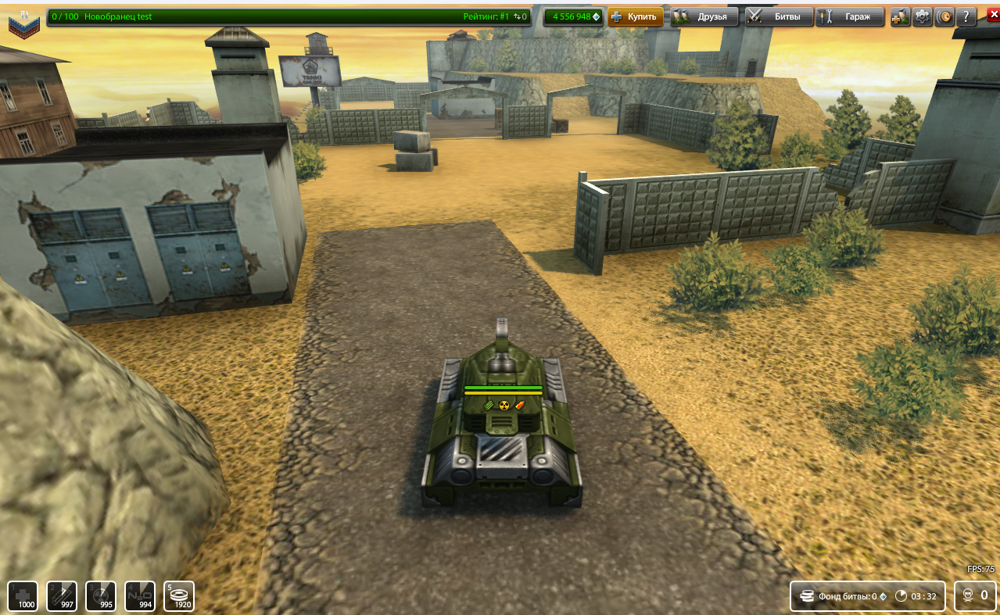
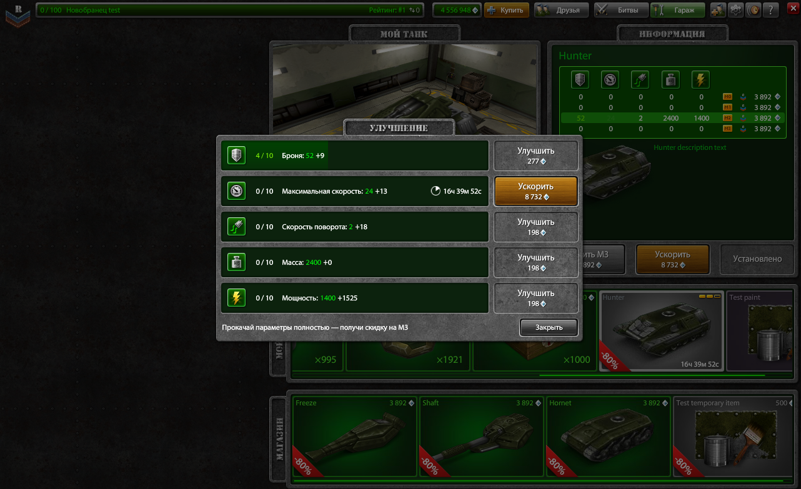
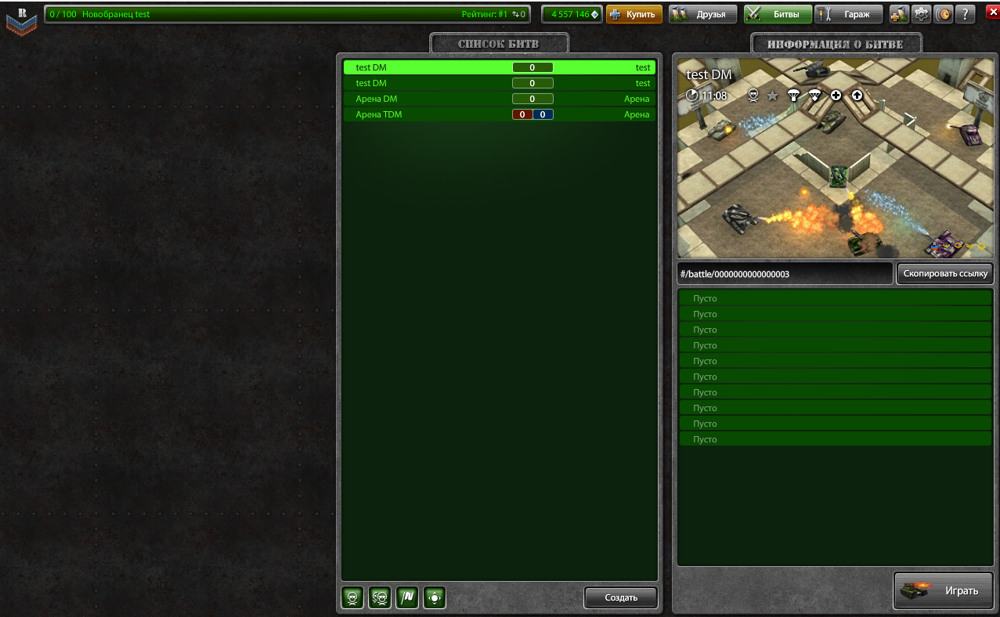

# Tanki 2014 server





This is server for the original tanki online client from 2014. I don't anymore develop it, so I decided to make it public. The server is not finished there is a lot of missing features.

I suggest using this code only as a documentation, because the code is not robust for real use. It has lot of bugs, doesn't have proper thread safety and also performance is poor. Also the architecture of the server is not ideal. If I would write it again, I would get rid of the client specifig spaces and I would make every space behave like global spaces do.

## Easy setup
Follow these steps if you want to get the server running quickly. You can ignore the "Manual setup" section, if you follow these. If you are planing to change the code, then follow the "Manual setup" section.

First you will need to instal Uniform Server 15.0.1. Uniform server will be used for hosting mysql database. If you already have mysql database, you can skip this section. 
1. Download 15_0_1_ZeroXV.exe https://sourceforge.net/projects/miniserver/files/Uniform%20Server%20ZeroXV/15_0_1_ZeroXV/15_0_1_ZeroXV.exe/download.
2. Run the downloaded exe file.
3. Change the path to `C:\`.
4. Navigate to `C:\UniServerZ` and run the `UniController.exe`
5. You will get prompt asking for password. Set it to `juho`. If you want to use different password, you will need to modify `database_password` property from `tanki_2014_server/config/server_proprties.json` to match your password.
6. After some time UniServer control panel will pop open. Click `Start MySQL` button.

Next follow these steps to setup the game server and client:
1. Download client and server zip files from releases.
2. Extract both zips.
3. Go into the `tanki_2014_server` folder and run `tanki_2014_server.exe`.
4. Go into the `tanki_2014_client` folder and run `x86_64-pc-windows-msvc-simple-http-server.exe`.
5. Now run the `tanki_2014.exe` and enjoy the game.

## Manual setup
If you want to make modifications to the code or run it directly using python for some other reason, then follow these instructions.

Use python 3.13.0 or newer. Some versions that are older than 3.13 and newer than 3.10 seems to cause `RuntimeError: can't create new thread at interpreter shutdown` error.

Intall requirments using the command ```pip install -r requirements.txt```. Consider setting up fresh venv before installing, because the requirments contain specifig version of certain packages and they may collide with already installed packets.

Resources can be found inside client_resources.7z. Unzip them and after that you should run `python_tools/generate_client_resource_folder.py` script. Change the SERVER_RESOURCE_FOLDER_PATH, CLIENT_RESOURCE_FOLDER_PATH, SERVER_CONFIG_FOLDER and WINDOWS_CACHE_PATH variables from the script before running it. The CLIENT_RESOURCE_FOLDER_PATH should point to the resources folder that is inside a folder that contains the client files. You can get the client from the releases.

Setup mysql database. I am using version 8.0.31. You should change DATABASE_USER and DATABASE_PASSWORD from configs/server_properties.json, if you are using different credentials. See the "Easy setup" section, for more info about setting up the mysql server.

Now if you run the game server and the http server from client folder, you should be able to connect.